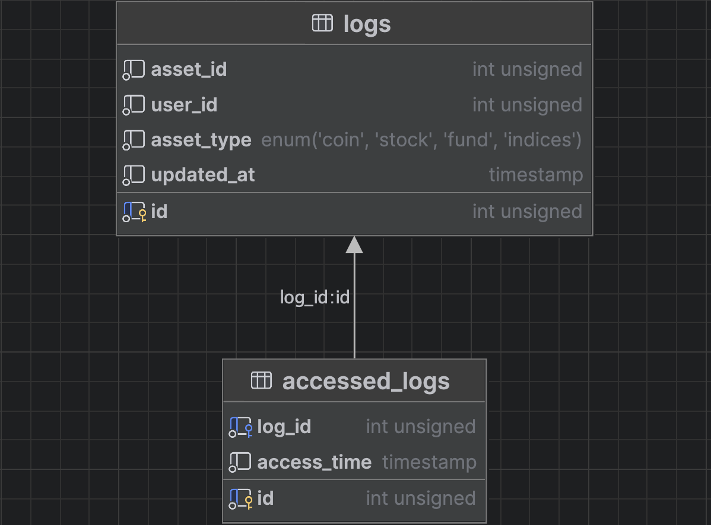

# Documentation

This markdown provides insights on the tools and the way of thinking of the project.

## Tools

### 1. NestJS

NestJS is a TypeScript-based Node.js framework for building scalable and efficient server-side applications.

### 2. MySQL

MySQL is a SQL database known for its speed, reliability, and ease of use.

### 3. RabbitMQ

RabbitMQ is a message broker that is used for communication between systems. It allows us to work asynchronously.

### 4. Swagger/OpenAPI

Swagger/OpenAPI is a tool for documenting and describing REST APIs.

### 5. JEST

Jest is a testing framework we use to test our code.

## Database model

I chose to have 2 entities for this case:
- Logs
- accessed_logs

### logs
This is the log entity that connects the asset tot the user. We keep track of the last time the user tried to access the log by the field updated_at.
We do not store every timestamp the user accessed a specific asset in this entity because we want to keep it light and we want to make sure our search is NOT based on the timestamp.

### Accessed logs
This is the accessed_log entity. We store all the timestamps when the user accessed a specific asset. We want to keep track of this information. Maybe There is no specific use for this in the current case but i like to keep in mind that maybe in the future we want to track how many times a user accessed an asset or when does the user mostly like to check his assets. It is valuable information we'd like to store so we can profit from it in the future.

## Tool selection

### NestJS

This framework in combination with TypeORM is so powerfull. NestJS handles a lot of stuff for you in the background. It is easily implemented and very easy to read with all the annotations. We can indicate very nicely what the function or class stands for with the indication of annotations.
It works with Injectable classes as well so we don't have to initialize all the classes ourselves.

### MySQL

There is no particular reason I chose MySQL. It is simply a very good SQL database with easy implementation, works well together with TypeORM, and I have never encountered any issues with MySQL. We could consider a NoSQL database as well, but I believe an SQL database is more suitable in this case because SQL databases generally handle searches better than NoSQL.

### RabbitMQ

We're implementing RabbitMQ to introduce asynchronous processing in our codebase. I believe that logging operations do not necessitate synchronous responses. Given our company serves 300,000 active users and has 5,000,000 unique users, we anticipate up to 1,000 users accessing a specific asset simultaneously. To prevent data loss or database crashes, we'll first enqueue all incoming logs.

Ideally, we wouldn't need an HTTP endpoint for this in our code; rather, other microservices would directly send messages to the queue. Unfortunately, this isn't the current setup. Therefore, every incoming POST log request will be sent to the queue, where a consumer will process each message sequentially and pass it on to the service responsible for data storage.

### Swagger/OpenAPI

We'll be using Swagger/OpenAPI to document our REST API. Swagger is a powerful tool for documenting endpoints, request bodies, entities, response bodies, and more. When paired with NestJS, this setup is straightforward and produces excellent results. Swagger not only documents our API comprehensively but also allows us to test requests directly through its 'try it out' feature.

### Jest

Jest is a JavaScript testing framework that we use for end-to-end testing of our API. We combine Jest with supertest, which simplifies endpoint access and helps us define expected outcomes.